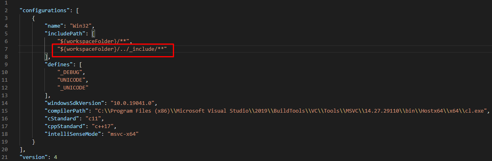

# Подключение библиотеки тестирования
{: .no_toc }    
Решим ее...  
## Содержание
{: .no_toc }  
1. TOC
{:toc}
# Установка библиотеки doctest
Для тестирования программы будем использовать библиотеку doctest. Скачиваем zip архив с сайта [https://github.com/onqtam/doctest](https://github.com/onqtam/doctest). Разархивируем и копируем файл с папкой ```doctest/doctest.h``` в папку ```_include```, расположенную на одном уровне с нашим проектом.  
# Установка библиотеки FakeIt
Для создания заглушек и шпионских объектов будем использовать библиотеку FakeIt. Скачиваем zip архив с сайта [https://github.com/eranpeer/FakeIt](https://github.com/eranpeer/FakeIt). Разархивируем и копируем файл ```single_header/standalone/fakeit.hpp``` в папку ```_include/fakeit```. Папка ```_include``` расположенa на одном уровне с нашим проектом. 

# Главный файл запуска и настройки тестирования
Если тесты настраиваются для приложения, имеющего главный файл с функцией  ```main()```, то создаем еще один файл с функцией ```main()``` и назовем его test.cpp.
Если тесты настраиваются для библиотеки, то в папке библиотеки, которую хотим тестировать добавляем файл test.cpp.
```c++
#define DOCTEST_CONFIG_IMPLEMENT
#include <windows.h>
#include "doctest/doctest.h"
#include "threads.hpp"

int main(int argc, char** argv) {
    SetConsoleOutputCP(1251);

    doctest::Context context;
    context.applyCommandLine(argc, argv);
    context.setOption("no-breaks", true); // don't break in the debugger when assertions fail

    int res = context.run(); 
    if(context.shouldExit()) // important - query flags (and --exit) rely on the user doing this
        return res;          
    int client_stuff_return_code = 0;   
    return res + client_stuff_return_code; // the result from doctest is propagated here as well
}
```
Объявление ```#define DOCTEST_CONFIG_IMPLEMENT``` сообщает библиотеке doctest, что мы создали свою функцию main(). Библиотека предоставляет возможности использовать автоматически создаваемую функцию main() (см. документацию).  
Своя функция main() нужна, чтобы добавить возможнось отображать кириллицу в консоли: названия тестов будем писать на русском (подробнее [здесь](./on_cyrillic.md)).  
```#include <windows.h>``` нужен для вывода кириллицы в консоль.  
```#include "doctest/doctest.h"``` - библиотека doctest.  
```#include "threads.hpp"``` - наша библиотека, которую мы тестируем.  
  
```c++
    SetConsoleOutputCP(1251);
```
Эта функция позволяет отображать кириллицу в консоли.  
  
Всесь дальнейший код функции main() - это конфигурирование библиотеки doctest. Мы взяли код из документации.

# Добавление тестов
В файле тестируемой библиотеки (например, threads.hpp) включаем библиотеку doctest:  
threads.hpp  
```c++
#include "doctest/doctest.h"

...
```
  
В конце исполняемого файла добавляем тесты:  
threads.hpp  
```c++
...

TEST_SUITE("Тест"){
    short k = 1;
    TEST_CASE("Тестируем ...") {
        CHECK(k == 1);
    }
}
```
  
# Настройка Конфигурации VSCode
Открываем файл ```c_cpp_properties.json``` в папке ```.vscode```. Если нет такого файла, то нажимаем ctrl+shift+P и набираем *"c/c++: Edit Configurations (Json)"*. В раздел ```"includePath"``` добаляем строку ```"${workspaceFolder}/../_include/**"```.  
Эта строка нужна, чтобы в VSCode правильно работал IntelliSence.  
c_cpp_properties.json  

# Настройка компилятора
Подготовка VSCode и настройка компилятора описана [здесь](./preparation.md).  
Добавляем task.json и launch.json. launch.json понадобится нам для отладки тестов.  
В tasks.json в аргументах компилятора ```"args"``` указываем:  
```"test.cpp"``` - компилируемый файл,
```"${workspaceFolder}\\test.exe"``` - конечный файл (тестовое приложение).
tasks.json  
```json
{
    "version": "2.0.0",
    "tasks": [
        {
            ...

            "args": [
                ...,
                "${workspaceFolder}\\test.exe",
                "test.cpp"
            ]

            ...
        }
    ]
}
```
Если в проекте уже есть ```task.json```, то добавляем еще одну задачу, можно просто скопировать задвчу ```task``` и изменить атрибут ```"label"``` - это название задачи. Назовем ее ```"tests"```. Также меняем атрибут ```"args"``` как описано выше.  
tasks.json  
```json
{
    "version": "2.0.0",
    "tasks": [
        {
            ...
        },
        {
            ...
            "label":"tests",
            ...

        }
    ]
}
```
Если в проекте уже есть ```launch.json```, то добавляем еще одну конфигурацию. Это нужно чтобы отлаживать тесты. Можно просто скопировать  конфигурацию ```configuration``` и изменить атрибуты ```"name"```, ```"program"``` и ```"preLaunchTask"```.    
```"preLaunchTask"``` - это атрибут, где хранится название задачи, запускаемой перед отладкой.  
launch.json  
```json
{
    "version": "0.2.0",
    "configurations": [
        {
            ...
        },
        {
            ...
            "name":"tests",
            "program": "test.exe",
            ...
            "preLaunchTask": "tests"
        }
    ]
}
```
Для того чтобы скомпилировать тесты, нажмаем ```Ctrl + Shift + B```. Теперь появляется две задачи. Выбираем задачу ```tests```. 
Все! Компилируем м запускаем test.exe.
