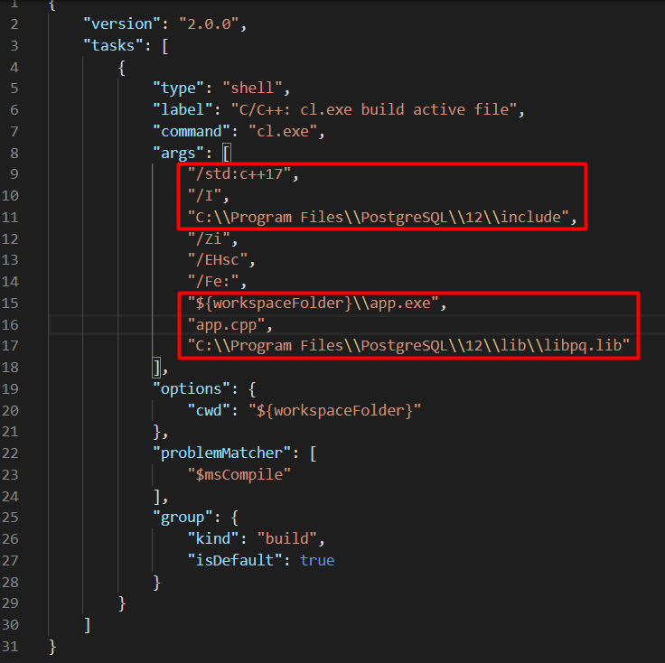
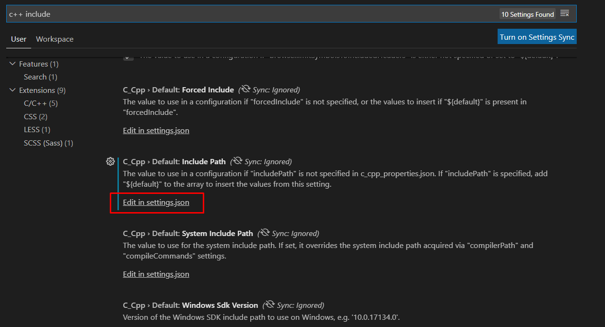
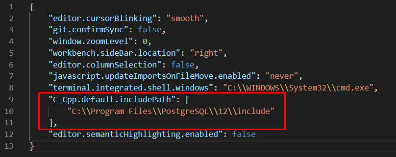

# Подготовка среды для разработки приложения
## Установка компонентов
Вся разработка ведется в Visual Studio Code.  
Можно использовать и Visual Studio 2019, но она очень много чего делает "под капотом" и добавляет много непонятных файлов в рабочую папку. А нам нужно понимание процесса. Хотя, конечно же, Visual Studio 2019 на порядок превосходит VS Code.  
Весь процесс установки и написания первого прилоэжения Hello world в VS Code описан [здесь](https://code.visualstudio.com/docs/cpp/config-msvc). Просто следуйте инструкциям.  
Так как мы разрабатываем приложение для работы с Postgre SQL, то нужно скачать и установить его [отсюда](https://www.enterprisedb.com/downloads/postgres-postgresql-downloads). У меня установлена последняя на данный момент 12 версия.

## Настройка Microsoft C++
Когда мы следовали инструкциям и создавали приложение Hello world, VS Code создал в нашей рабочей папке подпапку .vscode. Мы будем модифицировать файл task.json и launch.json. Откроем эти файлы в редакторе и заменим следующие строки.
### task.json


Первая строка указывает версию стандарта языка с++.
```
    "/std:c++17",
```
Следующие две строки указывают компилятору где искать заголовочные файлы библиотеки libpq с для работы с Postgre SQL.
```
    "/I",
    "C:\\Program Files\\PostgreSQL\\12\\include",
```
Следующие измененные строки указывают на то, куда компилировать и в каком файле находится функция main(). Я их прописал явно. Если оставить как есть, то чтобы скомпилировать программу всегда нужно будет переключаться главный файл (где реализована функция main()). У меня главный файл называется app.cpp.
```
    "${workspaceFolder}\\app.exe",
    "app.cpp",
```
И, наконец, последняя из измененных строка - это путь к самой библиотеке libpq.lib.
```
    "C:\\Program Files\\PostgreSQL\\12\\lib\\libpq.lib"
```
### launch.json
В файле launch.json измените атрибут programm чтобы не переключаться на главный файл при компиляции.
```
    "program": "app.exe",
```

### settings.json
Конфигурацию VS Code необходимо подправить чтобы Intellisence работал правильно и находил нужные библиотеки.
Для редактирования конфигурации VS Code откроем пункт меню File -> Preferences -> Settings. В открывшемся диалоге в стороке поиска нужно набрать: c++ include.  

  

Перейдем в редактирование в settings.json и заполним атрибут "C_Cpp.default.includePath":  



## Настройка переменных среды
В проводнике windows правой клавишей мыши щелкаем на "Этот компьютер". Выбираем "Свойства". Далее "Дополнительные параметры". Далее "Переменные среды". Выбераем переменную Path и нажмем Изменить. Добавим следующие строки:
```
C:\Program Files\PostgreSQL\12\lib
C:\Program Files\PostgreSQL\12\bin
C:\Program Files (x86)\Microsoft Visual Studio\2019\BuildTools\VC\Tools\MSVC\14.27.29110\bin\Hostx64\x64
```
Путь к библиотеке "...\lib" нужен чтобы наш скомпилированный exe при запуске нашел библиотеку libpq.lib.  
Папка "...\bin" программы PostgreSQL нужна, потому-что в ней хранятся другие библиотеки нужные для libpq.lib.  
Ну а путь к компилятору cl.exe нужен для VS Code. Без этого пути VS Code не найдет компилятор.

## Запуск VS Code
Для компилятора cl.exe важно для какой платформы настроена среда (x86 или x64). Поэтому, чтобы мы смогли запускать компиляцию из VS Code, нужно сам VS Code запустить из нужной среды.  
Нажмаем меню Пуск и в строке поиска наберем "vs" поиск найдет несколько командных панелей. Выбираем ту, в которой есть стоки "x64". В открывшейся командной панели перейдем к папке с проектом и выполним команду "code ."
```
**********************************************************************
** Visual Studio 2019 Developer Command Prompt v16.7.2
** Copyright (c) 2020 Microsoft Corporation
**********************************************************************
[vcvarsall.bat] Environment initialized for: 'x86_x64'

C:\Program Files (x86)\Microsoft Visual Studio\2019\Community>cd C:\Users\user\source\cpp\libpq_msvc

C:\Users\user\source\cpp\libpq_msvc>code .

C:\Users\user\source\cpp\libpq_msvc>
```

Ну, вот и все!


