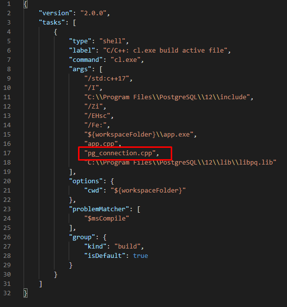
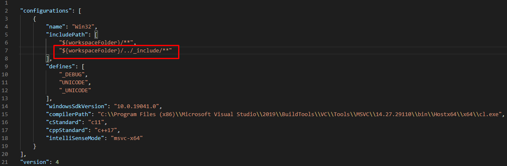

1. TOC
{:toc}
  
# Простая программа MPG для работы с PostgreSQL
В листинге приведен код простой программы, которая устанавливает соединение и выполняет запрос. Назовем эту программу MPG и поместим код программы в файл ```app.cpp```. 
app.cpp
```c++
#include <iostream>
#include <memory>
#include <string>
#include <libpq-fe.h>

class PGConnection
{
private:

    std::string dbhost = "localhost";
    std::string dbport = "5433";
    std::string dbname = "testdb";
    std::string dbuser = "postgres";
    std::string dbpass = "1";

    std::shared_ptr<PGconn> connection;

public:
    PGConnection()
    {
        connection.reset(PQsetdbLogin(
                               dbhost.c_str(),
                               dbport.c_str(),
                               nullptr,
                               nullptr,
                               dbname.c_str(),
                               dbuser.c_str(),
                               dbpass.c_str()),
                           &PQfinish);

        if (PQstatus(connection.get()) != CONNECTION_OK)
        {
            throw std::runtime_error(PQerrorMessage(connection.get()));
        }
    }

    int exec(const char *query)
    {
        PGresult *res = PQexec(connection.get(), query);
        if (PQresultStatus(res) == PGRES_FATAL_ERROR){
            throw std::runtime_error(PQerrorMessage(connection.get()));
        }
        int result_n = PQntuples(res);
        PQclear(res);
        return result_n;
    }
};

int main()
{
    PGConnection* conn = new PGConnection();
    std::cout << conn->exec("SELECT 1+1");
    delete conn;
}
```
Создаем класс ```PGconnection```. Определяем private свойства класса: ```dbhost, dbport, dbname, dbuser, dbpass``` - параметры для создания подключения. Они используются один раз в момент подключения. Отдельно  отметим private свойство ```connection``` - его сделали разделяемым умным указателем.  
В конструкторе ```PGConnection()``` мы устанавливаем соединение. Собственно, соединение устанавливает функция ```PGsetdbLogin()```, которой мы передаем параметры подключения. В умный указатель ```connection``` передаем результат выполнения функции ```PGsetdbLogin()``` и функцию деструктор ```PQfinish()``` для освобожденмя памяти.
По завершении ее выполнения мы проверяем статус (функция ```PQstatus()```) и, если соединение не установлено вызываем исключение. 

Также, в классе ```PGconnection``` определяем один метод ```exec()```. Этот метод выполняет запрос (функция ```PQexec()```) и возвращает количество строк в результате запроса (функция ```PQntuples()```). Обратите внимание что после анализа результата вызывается функция очищения ресурсов ```PQclear(res)```. В документации к ```libpq``` настоятельно требуют использовать именно ее для очистки памяти.  
Для проверки возвращаемого значения на наличие ошибок вызываем функцию ```PQresultStatus()```. В случае нулевого указателя она возвратит ```PGRES_FATAL_ERROR``` и мы вызовем исключение используя функцию ```PQerrorMessage()```.

В функции  ```main()``` создаем экземпляр класса ```PQConnection``` и выполняем запрос.
В результате выполнения программы получим 1. Запрос ```"SELECT 1+1"``` возращает одну строку с одним столбцом и значением 2.  
Обращаем внимание, что в конце ```main()``` вызываем ```delete conn```, чтобы очистить ресурсы выделенные оператором new.

# Рефакторинг PGConnection - раскладываем по файлам
Теперь описание класса ```PGConnection``` вынесем в отдельный заголовочный файл ```pg_connection.h``` в том же каталоге что и ```app.cpp```.  
pg_connection.h  
```c++
#ifndef PG_CONNECTION_H
#define PG_CONNECTION_H

#include <string>
#include <mutex>
#include <libpq-fe.h>

class PGConnection
{
private:
    std::string dbhost = "localhost";
    std::string dbport = "5433";
    std::string dbname = "testdb";
    std::string dbuser = "postgres";
    std::string dbpass = "1";

    std::shared_ptr<PGconn> connection; //Каждое соединение представляется объектом PGconn

public:
    PGConnection();
    int exec(const char *query);
};

#endif //PG_CONNECTION_H
```  
Реализацию класса ```PGConnection``` перенесем в файл ```pg_connection.cpp``` в том же каталоге что и ```app.cpp```.  
pg_connection.cpp  
```c++
#include "pg_connection.h"
#include <string>
#include <mutex>
#include <libpq-fe.h>

PGConnection::PGConnection()
{
    connection.reset(PQsetdbLogin(
                         dbhost.c_str(),
                         dbport.c_str(),
                         nullptr,
                         nullptr,
                         dbname.c_str(),
                         dbuser.c_str(),
                         dbpass.c_str()),
                     &PQfinish);

    if (PQstatus(connection.get()) != CONNECTION_OK)
    {
        throw std::runtime_error(PQerrorMessage(connection.get()));
    }
};

int PGConnection::exec(const char *query)
{
    PGresult *res = PQexec(connection.get(), query);
    if (PQresultStatus(res) == PGRES_FATAL_ERROR){
        throw std::runtime_error(PQerrorMessage(connection.get()));
    }
    int result_n = PQntuples(res);
    PQclear(res);
    return result_n;
}
```

В файле ```app.cpp``` добавим следующую строку.  
app.cpp  
```c++
#include "pg_connection.h"
```

Чтобы наша программа скомпилировалась, добавим в ```task.json``` в раздел ```"args"``` еще одну строку ```"pg_connection.cpp"```:  
task.json  
)
  
# Рефакторинг класса PGConnection - изменим функцию подключения к PostgreSQL
Теперь уберем параметры подключения из кода в конфигурационный файл. И заменим функцию подключения ```PQsetdblogin()``` на другую функцию подключения ```PQconnectdbParams()```. Это избавит нас от необходимости править код при изменении списка параметров подключения.

Во-первых, создадим сруктуру, для хранения параметров подключения. Мы будем читать параметры подключения из файла и записывать в эту структуру. Затем, при создании каждого подключения, мы будем брать параметры из этой структуры. Это пока у нас одно подключение, но когда мы будем делать поддержкку многопоточности, будем создавать несколько подключений. В файл ```pg_connection.h``` добавим структуру ```Connection_Params```.  
pg_connection.h  
```c++
...
#include <libpq-fe.h>

struct Connection_Params {
private:    
    std::vector<const char* > keys_ptr;
    std::vector<const char*> values_ptr;
public:
    Connection_Params();  
    ~Connection_Params();    
    void add_key(const char* key);
    void add_value(const char* key);
    std::vector<const char*> keys();
    std::vector<const char*> values();
};

class PGConnection
...
```  
Структура ```Connection_Params``` довольно громоздская, но это вынужденные затраты.
В файл ```pg_connection.cpp``` добавим реализацию этой структуры.  
pg_connection.cpp  
```c++
...
Connection_Params::Connection_Params()
    : keys_ptr(std::vector<const char*>())
    , values_ptr(std::vector<const char*>())
{
}

void add(std::vector<const char*> *vec, const char* val) {
    if (val != NULL) {
        char* tmp = new char[std::strlen(val) + 1];
        std::strcpy(tmp, val);
        (*vec).push_back(tmp);
    } else {
        (*vec).push_back(nullptr);
    }
}

void Connection_Params::add_key(const char* key)
{
    add(&keys_ptr, key);
}

void Connection_Params::add_value(const char* value)
{
    add(&values_ptr, value);
}

std::vector<const char*> Connection_Params::keys()
{
    return keys_ptr;
}

std::vector<const char*> Connection_Params::values()
{
    return values_ptr;
}

Connection_Params::~Connection_Params()
{
    std::vector<const char*>::iterator itr = keys_ptr.begin();
    while (itr != keys_ptr.end()) {
        delete *itr;
        ++itr;
    }
    keys_ptr.clear();
    itr = values_ptr.begin();
    while (itr != values_ptr.end()) {
        delete *itr;
        ++itr;
    }
    values_ptr.clear();
}
```
Здесь конструктор ```Connection_Params``` выполняет только инициализацию векторов: ```keys_ptr``` и ```values_ptr```. Эти векторы содержат указатели на константные значения ```char```.
Методы ```add_key()``` и ```add_value()``` идентичны, поэтому реализацию вынесем в отдельную функцию ```add()```, куда будем передавать не тоолько строку, но и указатель на вектор ```keys_ptr``` или ```values_ptr```.
В функции ```add()``` мы выделяем место под строку в куче, и переменной ```tmp``` присваиваем ссылку на это место. Далее копируем передаваемую строку в это место в куче и помещаем переменную ```tmp``` (т.е. указатель на строку) в массив.
Почему нельзя напрямую поместить в массив передаваемую ссылку на строку? Потому-что, объект класса ```Connection_Params``` живет до конца программы. Методы ```add_key()``` и ```add_value()``` будут вызываться из любой другой функции и мы не знаем как долго будет жить строковая переменная, ссылка на которую передается в ```add_key()``` или ```add_value()```. Выделение места в куче защищает нас от неожиданностей снаружи структуры ```Connection_Params```, но и обязывает самим заботиться об освобождении этого места.  
Деструктор ```~Connection_Params``` с помощью итератора по элементам векторов ```keys_ptr``` и ```values_ptr``` освобождает память от выделенных строковых переменных в куче и очищает сами векторы.  
Как видно из листинга векторы ```keys_ptr``` и ```values_ptr``` объявлены как закрытые, чтобы запретить доступ к ним извне. получить ссылки на эти векторы можно с помощью специальных функций ```keys()``` и ```values()```.


В файл ```pg_connection.h``` также добавим два метода для чтения этой структуры из файла.  
pg_connection.h  
```c++
...
class PGConnection
{
private:
    ...
    std::shared_ptr<std::string> load_params_to_str();
    std::shared_ptr<Connection_Params> parse_params_from_str(const char* str);
public:
    ...
};
``` 
Записывать параметры подключения будем в глобальную переменную.
В файле ```pg_connection.cpp``` добавим глобальную переменную, которую сделаем умным указателем на ```Connection_Papams```. В этой переменнлой и будем хранить ссылку на параметры подключения. Также зададим константу ```CONFIG_PATH``` - путь к файлу конфигурации (файл конфигурации лучше хранить в отдельной папке, на одном уровне с папкой нашего проекта). Мы жестко прописываем название папки и название файла. Как видно из листинга, мы добавили также ссылки на библиотеки ```filesystem```, ```fstream``` и ```iostream```.  
pg_connection.cpp  
```c++
...
#include <libpq-fe.h>

#include <filesystem>
#include <fstream>
#include <iostream>

const std::string CONFIG_PATH = "../config/config.json";
std::shared_ptr<Connection_Params> connection_params = nullptr;

PGConnection::PGConnection()
...
```
  
В файле ```pg_connection.cpp``` добавим реализацию метода ```load_params_to_str()```. Здесь мы проверяем существует ли файл методом ```std::filesystem::exists()```. Затем создаем поток ```std::fstream config_file``` и читаем из него строки ```params_line``` и соединяем строки в одну выходную строку ```params_str```.  
pg_connection.cpp  
```c++
...
int PGConnection::exec(const char *query)
{
    ...
};

std::shared_ptr<std::string> PGConnection::load_params_to_str()
{
    std::string params_str = "";
    std::string params_line;
    try {
        if (std::filesystem::exists(CONFIG_PATH)) {
            std::fstream config_file(CONFIG_PATH);
            while (std::getline(config_file, params_line)) {
                params_str += params_line;
            }
            config_file.close();
        } else {
            throw new std::exception("No config file. Add config file config/config.json");
        }
    } catch (std::exception e) {
        std::cout << e.what();
    };
    return std::make_shared<std::string>(params_str);
}
```  
  
Метод ```load_params_to_str()``` только читает файл, но теперь надо преобразовать строку в json. Для этого воспользуемся библиотекой [rapidjson](https://github.com/Tencent/rapidjson/). Сохраняем репозиторий на свой компьютер. Создаем папку на одном уровне с нашим проектом ```"_include"``` (подчекивание впереди добавлено, чтобы папка всегда была наверху списка папок). Распаковываем репозиторий и копируем папку ```"include/rapidjson"``` в папку ```"_include"```.  
Открываем файл ```c_cpp_properties.json``` в папке ```.vscode```. Если нет такого файла, то нажимаем ctrl+shift+P и набираем *"c/c++: Edit Configurations (Json)"*. В раздел ```"includePath"``` добаляем строку ```"${workspaceFolder}/../_include/**"```.  
c_cpp_properties.json  


В файле ```pg_connection.cpp``` добавляем ссылку на библиотеку ```rapidjson``` и добавляем реализацию метода ```parse_params_from_str()```, которому передаем строку, сформированную из конфигурационного файла. Этот метод, как раз, разбирает строку и возвращает умный указатель на ```Connection_Params```.  
pg_connection.cpp  
```c++
...
#include <rapidjson/document.h>
...
std::shared_ptr<std::string> PGConnection::load_params_to_str()
{
    ...
}

std::shared_ptr<Connection_Params> PGConnection::parse_params_from_str(const char* str)
{
    std::shared_ptr<Connection_Params> conn_params = nullptr;
    rapidjson::Document d;
    d.Parse(str);
    if (d.IsObject() && d.HasMember("connection_params")) {
        rapidjson::Value& d_params = d["connection_params"];
        if (d_params.IsObject()) {
            conn_params = std::make_shared<Connection_Params>();
            rapidjson::Value::ConstMemberIterator iter = d_params.MemberBegin();
            while (iter != d_params.MemberEnd()) {
                conn_params->add_key(iter->name.GetString());
                conn_params->add_value(iter->value.IsNull() ? "" : iter->value.GetString());
                ++iter;
            }
            conn_params->add_key(NULL);
        }
        else{
            printf("В конфигурационном файле неверно задан раздел \"connection_params\"");
        }
    }
    else{
        printf("В конфигурационном файле отсутствует раздел \"connection_params\"");
    }
    return conn_params;
}

```
Здесь мы создаем объект ```rapidjson::Document d```, который и разбирает передаванную строку. Первая проверка проверяет, что строка в конфигурационном файле является объектом и содержит член ```"connection_params"```. Потом мы читаем член ```"connection_params"``` в переменную ```d_params``` и, после проверки что ```d_params``` - это объект, с помощью итератора перебираем все члены объекта ```d_params```.  
С помощью функций итератора ```iter->name.GetString()``` и ```iter->value.GetString()``` получаем соответственно название параметра и его значение, и помещаем в соответсвующие векторы структуры ```Connection_Params``` с помощью методов ```conn_params->add_key()``` и ```conn_params->add_value()```.  
В конце, в вектор ключей добавляем значение ```NULL``` с помощью метода ```conn_params->add_key()```. Это нужно для функции ```PQconnectdbParams()```, она читает список ключей, пока на встретит NULL. Это написано в [документации к этой функции](https://postgrespro.ru/docs/postgresql/9.6/libpq-connect).
  
Полный код этого раздела можно найти [здесь]().

