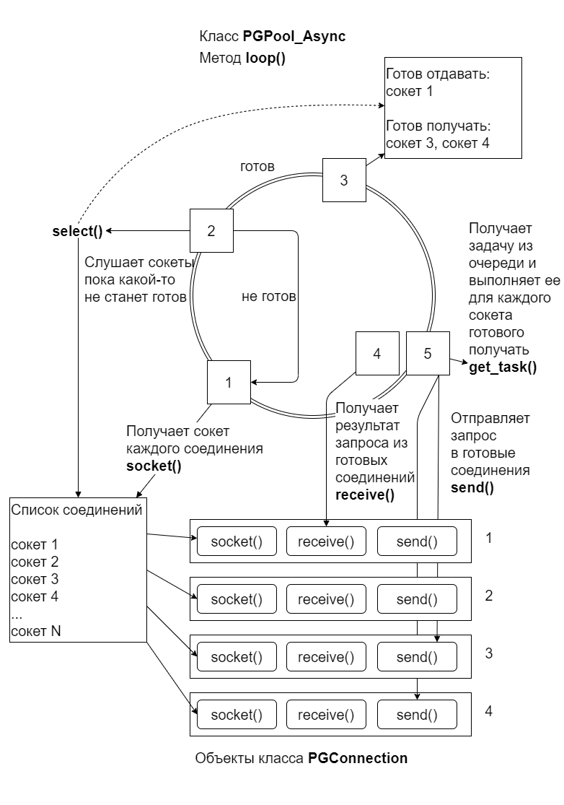

# Часть 3. Используем асинхронность
{: .no_toc }  
В [части 2](./PGConnection2.md) мы разработали класс ```PGPool_Threads```, который ускоряет наше приложение **mpg** запросов к базе данных PostgreSQL.  Класс ```PGPool_Threads``` ускоряет программу за счет многопоточности.  
  
Но есть еще один способ ускорить работу программы - это использование асинхронных запросов. Т. е. поток использует не блокирующие функции. Он берет соединение и отправляет ему запрос. При этом не ждет ответа, берет второе соединение и отправляет ему запрос. И так далее. Если от соединения пришел ответ, то программа читает его и отправляет на обработку.

Примечательность этого способа в том, что для такой работы нужен всего лишь один поток, в отличие от многопоточной обработки. Остальные потоки освобождаются.  Что касается производительности - увидим в конце.  
Рабочий проект этого раздела можно найти [здесь](https://github.com/profistarter/mpg/tree/1e281688ff8a9e771e9fb5cb1a21178971d44440) (ссылка на коммит).
## Содержание
{: .no_toc }  
1. TOC
{:toc}

# Класс PGPool_Async - цикл обработки запросов
Сам класс ```PGPool_Async```, который мы реализуем позже, не сложный, он содержит всего один метод ```loop()```, но какой... Для лучшего понимания работы этого метода приведена схема, нарисованная интуитивно, без использования нотации UML.  
  

  
Цикл выполняется пока не закончится очередь. Пока сделаем так, в будещем можем поменять на бесконечный цикл. Рассмотрим цикл пошагово:  
1. Перебираем все соединения и получаем сокет каждого соединения. По сути, сокет - это файловый дескриптор, принимающий состояния готов к чтению и готов к записи. Сетевые соединения, как в нашем случае, тоже представляются файловым дескриптором.
2. Вызываем функцию ```select()``` и передаем ей набор сокетов (в нашем случае все сокеты). Т.е. в каждый момент времени какие-то соединения обрабатывают запрос и мы ждем пока они предоставят результат, какие-то сокеты вернули результат и мы ждем пока они будут готовы к получению запроса. По готовности какого-то сокета функция ```select()``` сигнализирует о готовности. Если сигнал ложный мы возвращаемся к пункту 1 и ждем дальше.
3. Как только какие-то сокеты вернули информацию о готовности, мы получаем список сокетов готовых отдавать данные (вернуть результат запроса) или готовых получать данные (выполнить запрос). На схеме для примера указано, что состояние готовности вернули три сокета, сокет 1 готов вернуть результат запроса, сокеты 3 и 4 готовы выполнить запрос.  
4. Шаги 4 и 5 работают независимо и мы можем смело поменять их местами.  
Для всех сокетов, готовых отдавать мы выполняем метод ```receive()``` класса ```PGConnection``` и идем дальше.  
5. Для всех сокетов, готовых получать мы:
- получаем задачу из очереди,
- выполняем эту задачу, получая текст запроса,
- вызываем метод ```send()``` класса ```PGConnection```. Методу ```send()``` передаем текст запроса, и функцию обратного вызова. Нам же надо как-то сопоставить полученный результат в будущем именно с этим запросом. Один из выходов передавать соединению функцию, которая обработает результат именно этого запроса. Соединение не может принимать второй зарос пока не выполнит предыдущий, вот и будем хранить функцию обработки результата в самом соединении. А как это соединение отработает, вызовем эту функцию и вернем ей результат.  
1. Далее выполняем цикл по новой...

# Класс PGConnection - добавим методы асинхронных запросов
Откроем папку ```mpg``` и откроем файл ```pg_connection.h```.  
Добавим библиотеку ```<functional>```, мы будем описывать функции.  
```c++
#include <functional>
```
В классе ```PGConnection``` определим два типа:  
- Первый описывает результат выполнения запроса.  
- Второй описывает функцию обработки результата выполнения запроса.  
  
```c++
class PGConnection {
public:
    typedef std::vector<std::shared_ptr<PGresult>> Results;
    typedef std::function<void(Results)> Callback;

    ...
```
Добавим закрытые члены  
```c++
class PGConnection {
    ...

private:
    bool sending;
    bool receiving;
    Callback async_handler;
    Results results;
    int sock;
    bool clear_send();
    void error();
    ...
```
Свойства ```sending``` и ```recieving``` отражают состояние соединения - соответственно отправка запроса и ожидание ответа.  
Свойство ```Callback async_handler``` - это функция обработки результата запроса. Ее тип мы описали выше. Она ничего не возвращает и принимает вектор умных указателей на результат ```PGresult```. Почему результатов несколько? Потому что, неблокирующие функции, в отличие от ```PGexec()``` могут возвращать резульат двух и более запросов, объединенных в один (см. [документацию к libpq](https://postgrespro.ru/docs/postgresql/9.6/libpq-async)).  
Свойство ```Results results``` необходимо хранить в соединении, потому-что результат нескольких запросов, объединенных в один возвращается по мере выполнения каждого запроса. Мы будем получать результат и записывать его в вектор ```results```.  
 Свойство ```int sock```- это номер сокета, чтобы не запрошивать его каждый раз вызовом функции ```PGsocket()``` библиотеки ```libpq```.  
 И два метода: очистки состояния отправки и вывода ошибки.  
   
Следующие четыре метода являются открытыми и управляют асинхронными запросами.
```c++
class PGConnection {
    ...

public:
    ...

    void send(const char* query, Callback fn);
    void receive();
    bool is_ready();
    const int *socket();
}
```
Метод ```send()``` выполняем отправку запроса. Он принимает текст запроса и фукцию обработки результата запроса.  
Метод ```receive()``` выполняет получение данных соединения.  
Метод ```is_ready()``` сообщает о готовности соединения.  
Метод ```socket()``` возвращает момер сокета.  
  
Также изменим метод ```exec()``` (описание см. ниже):
```c++
    virtual std::vector<std::shared_ptr<PGresult>> exec(const char *query);
```
  
Теперь откроем файл ```pg_connection.cpp``` реализации класса ```PGConection```.
Изменим конструктор ```PGConection()```. Знаком ```/*--*/``` отмечены места вставки нового кода.  
```c++
PGConnection::PGConnection() 
    /*--*/
    : async_handler(nullptr)
    , sock(-1)
    , results()
    , sending(false)
    , receiving(false)
    /*--*/
{
    if (connection_params.get() == nullptr) {
        std::shared_ptr<std::string> str = this->load_params_to_str();
        connection_params = this->parse_params_from_str(str->c_str());
    }

    connection.reset(PQconnectdbParams(
                         connection_params.get()->keys().data(),
                         connection_params.get()->values().data(),
                         0),
        &PQfinish);

    if (PQstatus(connection.get()) != CONNECTION_OK /*--*/|| PQsetnonblocking(connection.get(), 1) == -1/*--*/) {
        std::cout << PQerrorMessage(connection.get()) << std::endl;
        throw std::runtime_error(PQerrorMessage(connection.get()));
    }
    /*--*/
    sock = PQsocket(connection.get());
    /*--*/
};
```
Здесь мы дополнительно инициализируем новые свойства, устанавливаем режим неблокирующего соединения и записываем номер сокета.
  
Мы поменяли метод ```exec()``` чтобы он тоже возвращал результат, чтобы тип возвращаемого результата был такой же как в методе ```receive()```. Метод ```exec()``` будет возвращать вектор с одним указателем на результат, так как результат всегда один, даже для для нескольких запросов, объединенных в один.
```c++
/*--*/std::vector<std::shared_ptr<PGresult>>/*--*/ PGConnection::exec(const char* query)
{
    /*--*/
    std::shared_ptr<PGresult> res;
    res.reset(PQexec(connection.get(), query), &PQclear);
    if (PQresultStatus(res.get()) == PGRES_FATAL_ERROR){
        error();
    }
    return std::vector<std::shared_ptr<PGresult>>{res};
    /*--*/
};
```
Заметьте в методе ```exec()``` создаем умный укзатель ```res```. Устанавливаем его методом ```res.reset()```, которому  кроме результата выполнения функции ```PQexec()``` бибилиотеки ```libpq``` передаем фунцию очистки результатов ```PQсlear()``` (см. [документацию libpq](https://postgrespro.ru/docs/postgresql/9.6/libpq-exec#libpq-exec-main)). Мощь умных указателей в том, что нам теперь не надо заботится об освобождении ресурсов. Функция деструктор ```PQclear()``` будет вызвана, когда последний указатель на результат будет уничтожен.  
  
Новый метод неблокирущих запросов:  
```c++
void PGConnection::send(const char* query, PGConnection::Callback fn)
{
    if(!clear_send() || receiving)
        return;
    int res = PQsendQuery(connection.get(), query);
    if(res == 0)
        error();
    async_handler = fn;
    sending = true;
    receiving = true;
};
```
Перед отправкой запроса нужно проверить, действительно ли очередь отправки запросов пустая. (см. [документацию к libpq](https://postgrespro.ru/docs/postgresql/9.6/libpq-async)). Это делаем, даже не смотря на то, что функция ```select()``` сообщила, что соединение готово к получению данных, ведь в очереди могли быть данные.  
Затем мы отправляем запрос и записываем функцию обработки результата запроса в соединение.  
Выставляем состояние отправки запроса и ожидания ответа.  
  
Новый метод получения результата:  
```c++
void PGConnection::receive(){
    while(receiving){
        if(!PQconsumeInput(connection.get()))
            error();
        if(!clear_send())
            return;
        if(PQisBusy(connection.get()))
            return;
        std::shared_ptr<PGresult> res;
        res.reset(PQgetResult(connection.get()), &PQclear);
        int res_status = PQresultStatus(res.get());

        if(res.get() != NULL){
            results.push_back(std::move(res));
        }
        else{
            receiving = false;
            if(async_handler){
                async_handler(results);
                async_handler = nullptr;
            }
        }
    }
}
```
Первые три ```if``` проверяют готовность соединения вернуть результат (см. [документацию к libpq](https://postgrespro.ru/docs/postgresql/9.6/libpq-async)).  
Если соединение готово вернуть результат, то мы с помощью функции ```PQgetResult()``` библиотеки ```libpq``` получаем результат выполнения запроса.  
Конструкция ниже - такая же как в методе ```exec()```:
```c++
        std::shared_ptr<PGresult> res;
        res.reset(PQgetResult(connection.get()), &PQclear);
```
  
Последняя проверка проверяет результат на ```NULL``` - это означает конец, больше результата не будет, ведь мы можем получать несколько результатов, если в один запрос объединены несколько запросов.  
Если конец результатам, то вызываем функцию обработки результата запроса и передаем ей вектор результатов.  
  
Следующие четыре новых метода обслуживают наши методы неблокирующих запросов.  
```c++
bool PGConnection::clear_send(){
    if(sending){
        int clr = PQflush(connection.get());
        if(clr == -1)
            error();
        else if(clr == 0){
            sending = false;
        }            
    }
    return !sending;
}
bool PGConnection::is_ready(){
    return !sending && !receiving;
}

const int *PGConnection::socket(){
    return &sock;
}

void PGConnection::error(){
    std::cout << utils::cpt(PQerrorMessage(connection.get())) << std::endl;
    throw std::runtime_error(PQerrorMessage(connection.get()));
}
```
В методе ```clear_send()``` вызываем метод ```PQflush()``` библиотеки ```libpq``` (см. [документацию к libpq](https://postgrespro.ru/docs/postgresql/9.6/libpq-async)).
  
# Класс PGPool_Async - определение
В папке ```mpg``` создадим файл ```pg_pool_async.hpp```.
В файл включим библиотеки и определим макрос:
```c++
#include <mutex>
#include <vector>
#include <queue>
#ifdef WIN32
#include <windows.h>
#pragma comment (lib, "Ws2_32.lib")
#pragma comment (lib, "Mswsock.lib")
#endif
#include "pg_connection.h"
#include "../utils/queue.hpp"
#undef max
#define max(x,y) ((x) > (y) ? (x) : (y))
```
Библиотеки ```Ws2_32.lib``` и ```Mswsock.lib``` нужны для правильной работы функции ```select()```.
  
Определим секцию HEADER:
```c++
/* --------------------------------------------------- */
/*                       HEADER                        */
/* --------------------------------------------------- */

template <typename R, typename ...Args>
class PGPool_Async {
public:
    typedef std::function<R(Args...)> Queue_Fn; 
    typedef std::vector<std::shared_ptr<PGConnection>> Conns_Vector;

private:
    Conns_Vector conns;
    TQueue<Queue_Fn> queue;
    void for_each_conn(std::function<void(std::shared_ptr<PGConnection> conn, const int* sock)> fn);
    void loop(std::shared_ptr<TQueue<Queue_Fn>> _queue, Args... args);

public:
    PGPool_Async(int num_connections);
    void run(std::shared_ptr<TQueue<Queue_Fn>> _queue, Args... args){
        loop(_queue, args...);
    }
};
```
Класс PGPool_Async - это шаблон. Объеявление перед классом указывает на это.  
```c++
template <typename R, typename ...Args>
```
Шаблон это прототип класса. Когда мы будем создавать объект этого класса мы будем передавать параметры ```R``` и ```...Args```. В зависимости от передаваемых параметров, компилятор будет создавать уже конкретные классы для каждого типа ```R``` и ```...Args```. Этот процесс называется инстанцирование.  
В классе ```PGPool_Async``` определим два типа:  
```c++
public:
    typedef std::function<R(Args...)> Queue_Fn; 
    typedef std::vector<std::shared_ptr<PGConnection>> Conns_Vector;
```
Тип ```Queue_Fn``` - это функция типа R(Args..), т.е. возвращаемый тип ```R```, а аргументы функции ```Args...``` Например, ```R = std::string```, а ```Args... = int```, тогда тип функции ```Queue_Fn``` можно записать так ``` std::string(int)```. Конструкция ```Args...``` называется Parameter Pack. Эта конструкция используется, когда мы заранее не знаем сколько и какие аргументы мы будем передавать в функцию.  
Фукции ```Queue_Fn``` - это функции, которые мы будем записывать в очередь заданий.  
  
Тип ```Conns_Vector``` - это вектор умных указателей на соединение ```PGConnection```.
  
Закрытые чдены:
```c++
private:
    Conns_Vector conns;
    TQueue<Queue_Fn> queue;
    void for_each_conn(std::function<void(std::shared_ptr<PGConnection> conn, const int* sock)> fn);
    void loop(std::shared_ptr<TQueue<Queue_Fn>> _queue, Args... args);
```
Свойство ```Conns_Vector conns``` - хранит вектор соединений. Все соединения в этом векторе прослушивает и обрабатывает метод ```loop()```.
Свойство ```TQueue<Queue_Fn> queue```  - хранит очередь заданий (функций типа ```Queue_Fn```).  
Метод ```for_each_conn()```- вспомогательный метод для групповой обработки всех соединений. Методу передается функция ```fn``` с аргументами (соединение ```conn``` и сокет ```sock```). Метод ```for_each_conn()``` перебирает все соединения и пердает функции ```fn``` каждое соединение и сокет, соответствующий этому соединению.  
Метод ```loop()``` - главный метод этого класса. Работа этого метода подробно описана в первом разделе этой части.
  
Публичные члены:
```c++
public:
    PGPool_Async(int num_connections);
    void run(std::shared_ptr<TQueue<Queue_Fn>> _queue, Args... args){
        loop(_queue, args...);
    }
```
Конструктор ```PGPool_Async```.  
Метод ```run()``` - обертка над методом ```loop()```.  

# Класс PGPool_Async - реализация
В том же файле ```pg_pool_async.hpp``` напишем реализацию класса ```PGPool_Async``` - добавим секцию IMPLEMENTATION:
```c++
/* --------------------------------------------------- */
/*                   IMPLEMENTATION                    */
/* --------------------------------------------------- */

template <typename R, typename ...Args>
PGPool_Async<R, Args...>::PGPool_Async(int num_connections)
        : conns(Conns_Vector(num_connections))
        , queue()
{
    Conns_Vector::iterator iter = conns.begin();
    while (iter != conns.end()) {
        *iter = std::make_shared<PGConnection>();
        ++iter;
    }
}

template <typename R, typename ...Args>
void PGPool_Async<R, Args...>::for_each_conn(std::function<void(std::shared_ptr<PGConnection> conn, const int* sock)> fn){
    Conns_Vector::iterator iter = conns.begin();
    while (iter != conns.end()) {
        const int *sock = (*iter)->socket();//PGConnection::socket()
        if (*sock == -1) {
            perror("socket");
        }
        else {
            fn((*iter), sock);
        }
        ++iter;
    }
}

template <typename R, typename ...Args>
void PGPool_Async<R, Args...>::loop(std::shared_ptr<TQueue<Queue_Fn>> _queue, Args... args){
    bool queue_end = false;
    while(!queue_end){
        int nfds = 0;
        fd_set input_mask;
        fd_set output_mask;
        FD_ZERO(&input_mask);
        FD_ZERO(&output_mask);

        for_each_conn([&nfds, &input_mask, &output_mask](std::shared_ptr<PGConnection> conn, const int *sock) mutable {
            FD_SET(*sock, &input_mask);
            FD_SET(*sock, &output_mask);
            nfds = max(nfds, *sock);
        });
        struct timeval timeout;
        timeout.tv_sec = 1;
        timeout.tv_usec = 1;
        if (select(nfds, &input_mask, &output_mask, NULL, &timeout) < 0)
        {
            fprintf(stderr, "select() failed: %s\n", strerror(errno));
        }

        for_each_conn([&input_mask, &output_mask, _queue, &queue_end, args...](std::shared_ptr<PGConnection> conn, const int* sock) mutable {
            if (FD_ISSET(*sock, &output_mask)){
                if(conn->is_ready()){
                    Queue_Fn task = _queue->get_task(&queue_end);
                    if(!queue_end){
                        std::string res = task(args...);
                        conn->send(res.c_str(), [](std::vector<std::shared_ptr<PGresult>> results) { //PGConnection::send();
                            auto iter = results.begin();
                            while(iter != results.end()){
                                if((*iter).get() != NULL)
                                {
                                    PQntuples((*iter).get());
                                }
                                ++iter;
                            }
                        });
                    }
                }
            }
            if (FD_ISSET(*sock, &input_mask))
                conn->receive(); //PGConnection::recive();
        });
    }
}
```
Конструктор создает новые соединения - объекты класса ```PGConnection```.
Метод ```for_each_conn()``` используется в методе  ```loop()``` дважды: 
- перед вызовом функции ```select()``` для подготовки "наборов" файловых дескрипторов для передачи функции ```select()```; 
- после вызова функции ```select()``` для обработки сокетов оставшихся в "наборах" (это сокеты готовые либо получать данные, либо отдавать данные).  
Работа метода ```select()``` подробно описана [здесь](http://ru.manpages.org/select/2).  
  
Особый интерес представляет обработка сокетов оставшихся в "наборах".  
Если сокет остался в наборе ```output_mask```, то:
1. Проверяем готово ли соединение для отправки запроса.
2. Если готово, получаем задачу из очереди.
3. Если не конец очереди, выполняем эту задачу и получаем тест запроса.
4. Выполняем метод ```send()``` класса ```PGConnection```, передавая ему текст запроса и функцию обратного вызова - обработки результатов запроса.  
  
Если сокет остался в наборе ```input_mask```, вызываем метод ```receive()```  класса ```PGConnection```.

# Проверяем скорость - изменяем main()
В папке ```mpg``` откроем файл ```app.cpp```. Внесем в него следцющие изменения:
Добавим файл ```pg_pool_async.hpp``` в секцию ```include```:
```c++
#include "pg_pool_async.hpp"
```
Перед функцией ```main()``` добавим двe функции:
```c++
void async(const int &num_query, const Weight &weight, const int &num_connections){
    std::shared_ptr<TQueue<String_Fn>> queue = get_queue(num_query);
    PGPool_Async<std::string, Weight> pool_async{num_connections};
    Timer t2;
    pool_async.run(queue, weight);
    std::cout << " " << t2.elapsed() << " \t |";
}

void async_threads(const int &num_query, const Weight &weight, const int &num_connections){
    std::shared_ptr<TQueue<String_Fn>> queue = get_queue(num_query);
    PGPool_Async<std::string, Weight> pool_async{num_connections};
    PGPool_Async<std::string, Weight> pool_async2{num_connections};
    Timer t3;
    {
        std::vector<std::thread> threads(2);
        threads[0] = std::thread(&PGPool_Async<std::string, Weight>::run,
            std::ref(pool_async), std::ref(queue), weight);
        threads[1] = std::thread(&PGPool_Async<std::string, Weight>::run,
            std::ref(pool_async2), std::ref(queue), weight);

        std::vector<std::thread>::iterator iter = threads.begin();
        iter = threads.begin();
        while(iter != threads.end()){
            (*iter).join();
            ++iter;
        }
    }
    std::cout << " " << t3.elapsed() << " \t |";
}
```
Первая функция ```async()``` выполняет запуск асинхронной обработки очереди заданий и выполнения запросов к PostgreSQL.   
Вторая функция ```async_threads()``` выполняет то же самое, что и функция ```async()```, только в двух потоках.  
  
В функцию ```main()``` добавим следующий код:
```c++
    //=============Асинхронно
    std::cout << "| ------------------------------------------------------------------------" << std::endl;
    for (int i = 1; i < 6; ++i){
        std::cout << utils::cpt("| асинхронно ") << i << utils::cpt(" соединений \t |");
        async(num_query, Weight::little, i);
        async(num_query, Weight::medium, i);
        async(num_query, Weight::large, i);
        std::cout << std::endl;
    }

    //=============Асинхронно 2 потока
    std::cout << "| ------------------------------------------------------------------------" << std::endl;
    for (int i = 1; i < 6; ++i){
        std::cout << utils::cpt("| асинх (2 потока) ") << i << utils::cpt(" соедин. \t |");
        async_threads(num_query, Weight::little, i);
        async_threads(num_query, Weight::medium, i);
        async_threads(num_query, Weight::large, i);
        std::cout << std::endl;
    }
```
После компиляции и запуска имеем сравнение быстродействия  разных способов обработки заданий очереди:
```
| выполнение \ объем таблицы     | малый         | средний       | большой       |
| -------------------------------------------------------------------------
| последовательно                | 0.0257737     | 0.381668      | 0.740079      |
| -------------------------------------------------------------------------
| параллельно 1 потоков          | 0.0245557     | 0.380629      | 0.739402      |
| параллельно 2 потоков          | 0.015222      | 0.194843      | 0.373242      |
| параллельно 3 потоков          | 0.011167      | 0.138497      | 0.259905      |
| параллельно 4 потоков          | 0.010147      | 0.114678      | 0.221329      |
| параллельно 5 потоков          | 0.0100253     | 0.110904      | 0.211809      |
| ------------------------------------------------------------------------
| асинхронно 1 соединений        | 0.0224644     | 0.382126      | 0.775296      |
| асинхронно 2 соединений        | 0.0132244     | 0.204198      | 0.386313      |
| асинхронно 3 соединений        | 0.0109921     | 0.146023      | 0.279174      |
| асинхронно 4 соединений        | 0.0107679     | 0.126204      | 0.242284      |
| асинхронно 5 соединений        | 0.0108737     | 0.115834      | 0.230503      |
| ------------------------------------------------------------------------
| асинх (2 потока) по 1 соед.    | 0.0139679     | 0.222323      | 0.430499      |
| асинх (2 потока) по 2 соед.    | 0.0100619     | 0.148024      | 0.284397      |
| асинх (2 потока) по 3 соед.    | 0.0101957     | 0.125382      | 0.241771      |
| асинх (2 потока) по 4 соед.    | 0.0099372     | 0.123027      | 0.235636      |
| асинх (2 потока) по 5 соед.    | 0.0099194     | 0.127868      | 0.242489      |
```
Здесь рассмотрены четыре способа обработки заданий очереди:
1. Последовательно.  
2. Параллельно N потоков.  
3. Асинхронно N соединений.  
4. Асинхронно (2 потока) по N соединений.  
  
Обратите внимание на схожий результат для:
- четырех потоков параллельной обработки (второй способ), 
- четырех соединений асинхронной обработки (третий способ),
- трех соединений асинхронной обработки в двух потоках (шесть соединений) (четвертый способ).
    
Во втотором способе обработки очереди заданий мы увеличиваем количество потоков, где каждый поток простаивает пока ждет результатов запроса, потому что используются блокирующие функции ```PGexec()``` библиотеки ```libpq```.  
В третьем способе мы используем всего один поток, так как этого достаточно, потому что поток не поростаивает и обрабатывет все соединения. В этом случае мы используем неблокирующие функции ```PGsend()``` библиотеки ```libpq```.  
В четвертом способе мы разделили асинхронную обработку на два потока, но это не добавило производительности нашему приложению.  
  
Операционная система оптимизирует работу потоков таким образом, что пока один поток ждет результата запроса в этот момент выполняются другие потоки.  
В многопоточной обработке каждому потоку соответствует одно соединение и мы выявили оптимальное количество потоков (соединений) на нашем компьютере - 4.  
В асинхронной обработке мы выявили оптимальное количество соедиинений на нашем компьютере - 4.  
Т.е. результат одинаковый.  
Четвертый способ обработки показывает даже худший результат.


