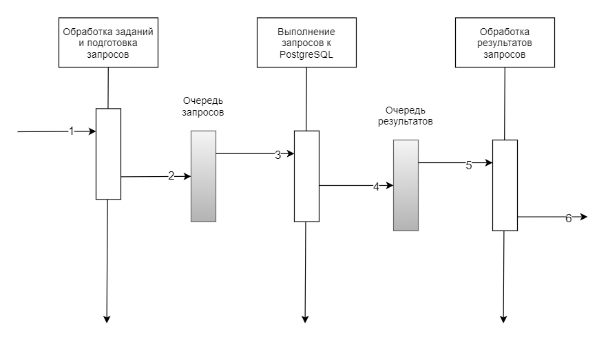

# Часть 4. Модульная система
{: .no_toc }  
В [части 3](./PGConnection3.md) мы разработали класс ```PGPool_Async``` и сравнили быстродействие разных способов обработки запросов к PostgreSQL.  
Разберем теперь, как это можно использовать и как построить нашу программу используя эти знания.  
## Содержание
{: .no_toc }  
1. TOC
{:toc}

# Автономные модули 
Представим, что каждый модуль работает автономно. Для примера, выделим три модуля:
1. **Обработка заданий и подготовка запросов**. Этот модуль принимает на входе задание. Согласно заданию, используя шаблоны он подготавливает запрос и параметры запроса.
2. **Выполнение запросов к PostgreSQL**. Этот модуль выполняет запросы к серверу PostgreSQL.
3. **Обработка результатов запросов**. Этот модуль каким-то образом трансформирует результат запроса в вид, понятный программе (другим модулям).


  
Каждый модуль выполняет задание из очереди и помещает результат в очередь следующего модуля. Результат будет заданием для следующего модуля.  
  
В предыдущих двух частях мы разработали прототип второго модуля (Выполнение запросов к PostgreSQL), причем в двух вариантах: многопоточный и асинхронный.

# Что дальше
Прежде чем перейти к реализации модульной системы, разработаем прототип модуля обработки заданий и подготовки запросов. Затем посмотрим как эти модули работают вместе.
