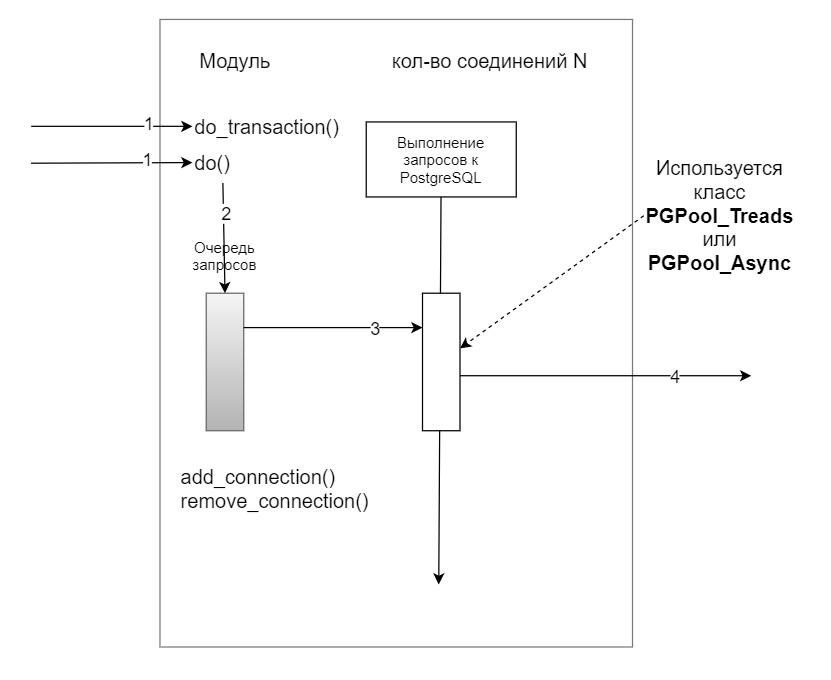

# Часть 5. Модульная система
{: .no_toc }  
В [части 3](./PGConnection3.md) мы разработали класс ```PGPool_Async``` и сравнили быстродействие разных способов обработки запросов к PostgreSQL.  
Разберем теперь, как это можно использовать и как построить нашу программу используя эти знания.  
## Содержание
{: .no_toc }  
1. TOC
{:toc}

# Автономные модули 
Представим, что каждый модуль работает автономно. Для примера, выделим три модуля:
1. **Обработка заданий и подготовка запросов**. Этот модуль принимает на входе задание. Согласно заданию, используя шаблоны он подготавливает запрос и параметры запроса.
2. **Выполнение запросов к PostgreSQL**. Этот модуль выполняет запросы к серверу PostgreSQL.
3. **Обработка результатов запросов**. Этот модуль каким-то образом трансформирует результат запроса в вид, понятный программе (другим модулям).


  
Каждый модуль выполняет задание из очереди и помещает результат в очередь следующего модуля. Результат будет заданием для следующего модуля.  

# Автономный модуль - Архитектура  
В предыдущих двух частях мы разработали прототип второго модуля (Выполнение запросов к PostgreSQL), причем в двух вариантах: многопоточный и асинхронный.  
Посмотрим как "спрятать" все это в Автономный модуль.  

  
Мы реализовали стрелку 3 - получение задания из очереди и выполнение запроса, а также стрелку 4 - вызов функции обратного вызова (обработки результата).  
Для реализации автономного модуля, нам нужно реализовать:
- методы ```do()``` и ```do_transaction()```.  Метод ```do_transaction()``` имеет особенность: транзакция может выполняться только одним соединением, нам нужно это как-то учитывать;
- методы ```add_connection()``` и ```remove_connection()``` - мы будем управлять количеством соединений прямо в процессе работы программы. Причем в многопоточном способе работы мы тоже управляем соединениями, где каждый поток - это отдельное соединение;
- бесконечный цикл - сейчас цикл работает пока не закончится очередь;
- возможность использовать как многопоточный способ работы, так и асинхронный способ. Пока не известно в каких ситуациях асинхронный способ предпочтительней;
- структуру задания очереди заданий: т.е. теперь в очереди заданий будет не только функция-задание, но и функция обратного вызова, название, параметры запроса и др.;
- а также возможность использовать подготовленные запросы.

# Что дальше?
Дальше мы будем параллельно разрабатывать два модуля: 
- Обработка заданий и подготовка запросов.
- Выполнение запросов к PostgreSQL.
  
Модуль обработки заданий и подготовки запросов будем разрабатывать в отдельном разделе - это будет независимый автономный модуль.  
Модуль выполнения заросов к PostgreSQL будем продолжать разрабатывать в этом разделе. Далее в этом разделе мы соединим, все вместе. 