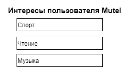
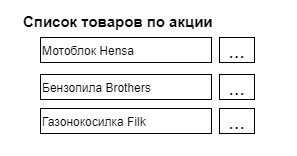

# Часть 1. Начало разработки модуля обработки заданий и подготовки запросов
{: .no_toc }  
В [части 5. Разработка mpg](./PGConnection5.md) мы закончили разрабатывать прототип модуля Выполнения звпросов к PostgreSQL и обсудили модульную систему. Одной из частей такой комплексной модульной системы является модуль Обработки заданий и подготовки запросов, который подготавливает запрос и помещает его в очередь запросов модуля Выполнения запросов.  
  
Сейчас рассмотрим и разработаем прототип модуля Подготовки запросов (далее - Модуль или Подсистема). Когда в тексте встречается термин Программа, то имеется ввиду целостная система, объединяющая все модули.
## Содержание
{: .no_toc }  
1. TOC
{:toc}

# Общие положения 
Что Модуль дожен делать:
- Модуль должен предоставлять конечному пользователю возможность самому создавать и изменять структуру данных. Эта структура данных является нелинейной, т.е. не просто набор столбцов какой-то сущности, но и набор связей между сущностями.  
- Возможность создавать и изменять структуру данных должна быть простой и понятной.  
- Структура создаваемой БД хранится рядом с данными в той же БД.  
- Модуль должен предоставлять конечному пользователю возможность добавлять и изменять данные, соответствующие указанной структуре.
- Ну и, Модуль должен позволять делать выборки данных. Здесь пока затрудняемся выдвинуть требование простоты и понятности.
  

# Структуры данных и отношения
Сложность структуры ланных определяется отношениями между сущностями структуры. Сущности структуры - это элементы предметной области, которую мы автоматизируем. В результате опыта работы в разных предметных областях мы попытались выделить несколько, наиболее часто встречающихся отношений между сущностями. Этот список отношений не полный, и кончно же будет расширяться с ростом системы.  
Отношения также влияют на представление предметной области (грубо сказать - интерфейс пользователя). Конечно же нельзя интерфейс пользователя проецировать на структуру базы данных. Мы не будем этого делать, просто наглядное представление порой бывает лучше тысячи слов.  В каждом разделе, описывая примеры, будем показывать как это отнощение воспринимается с точки зрения предметной области.
  
Далее рассмотрим отношения и примеры их использования.  

## 1. Ссылка
Далее выделены две ссылки, которые, с точки зрения системы, являются абсолютно идентичными, но различаются с точки зрения предметной области.
### 1.1. Простая ссылка
Структура реляционных таблиц может быть следующей:  
  
В этом примере показана простая ссылка: ```Роль пользователя``` является ролью, настроенной для организации (ссылается на ```Роль организации```), которой принадлежит пользователь. Здесь показана ситуация, когда у сущности Роль пользователя есть два ключевых поля ```id``` и ```userId``` . Также у Роли организации есть два ключевых поля ```id``` и ```entityId```.   
**PK** - primary key (первичный ключ): используется для указания полей, идентифицирующих запись.  
**FK** - foreign key (внешний ключ): используется для указания идентифицирующих полей записи из другой таблицы, на которую ссылаемся.   
Эти ключи обеспечивают целостность базы данных. Т.е. СУБД (в нашем случае PostgreSQL) сама отслеживает, чтобы не было ссылок на запись, отсутствующую в другой таблице.
  
Вот как видится это с точки зрения **предметной области**:  
  
  
**Возможные выборки**:
- показать всех пользователей, обладающих конкретной ролью организации.
  
### 1.2. Ссылка на справочник
Структура реляционных таблиц может быть следующей:  
  
В этом примере показана простая ссылка: ```Документ``` имеет вид Приказ из списка ```Вид документа```. 
  
Вот как видится это с точки зрения **предметной области**:  
  
  
**Возможные выборки**:
- показать все документы этого вида.
## 2. Агрегация
Далее выделены два вида агрегации.
### 2.1. Простая агрегация
Структура реляционных таблиц может быть следующей:  
  
На схеме в качестве примера показаны две простые агрегации.  
Вот как видится это с точки зрения **предметной области**:  
  
  
**Возможные выборки**:
- показать все версии этого продукта;
- показать все подсистемы этого продукта.  
  
### 2.2. Агрегация с выбором
Агрегация с выбором используется, когда сущность может быть агрегирована в разные сущности.  
В нотации UML это выглядит так:  
  
  
Структура реляционных таблиц может быть следующей:  
  
  
В **предметной области** это будет выглядеть как простая агрегация.  
  
**Возможные выборки**:
- выбрать все документы, удостоверяющие право собственности по зданию "такому-то";
- выбрать все документы, удостоверяющие право собственности по земельному участку "такому-то";
- выбрать все документы на земельные участки и здания по конкретному собственнику.  
   
## 3. Множественные ссылки
Множественные ссылки имеют схожую структуру таблиц. Отличается только то, как это видится из предметной области
### 3.1. Группа ссылок на объекты одного класса
Группа ссылок это несколько ссылок. Мы можем объединить их в группу, потому-что ссылаемся на объекты одного класса.  
Структура реляционных таблиц может быть следующей:  
  
Здесь специальная сущность агрегируется в сущность Пользователь и из нее указывается ссылка на сущность Интерес.

Вот как видится это с точки зрения **предметной области**:  
  
  
**Возможные выборки**:
- выбрать все интересы пользователя;
- выбрать всех пользователей по заданному интересу.
    
### 3.2. Именованная группа ссылок на объекты одного класса
Именованная группа ссылок это то же самое, что и просто группа ссылок, только агрегируемая сущность  имеет название. Эту конструкцию лучше собирать "руками", т.е. в структуре таблиц создать агрегацию и добавить ссылку. Хотя, возможно, мы реализуем это отношение как одно.  
Структура реляционных таблиц может быть следующей:  
  
Здесь именованная сущность Товар по акции агрегируется в сущность Торговый отдел и из нее указывается ссылка на сущность Товар.

Вот как видится это с точки зрения **предметной области**:  
  
  
**Возможные выборки**:
- выбрать все акционные товары этого отдела;
- выбрать все отделы, которые продают данный товар по акции.  
  
### 3.3. Двухсторонняя группа ссылок
Двухсторонняя группа ссылок похожа на группу ссылок на объекты одного класса, только можно ссылаться как из ссылающегося объекта, так и из ссылаемого объекта.    
Структура реляционных таблиц может быть следующей:  
  
Здесь специальная сущность агрегируется в сущность Пользователь и агрегируется в сущность Группа. Таким образом, имеем Пользователя, имеющего группу ссылок на Группу, и Группу, имеющую группу ссылок на Пользователя.

Вот как видится это с точки зрения **предметной области**:  
  
  
**Возможные выборки**:
- выбрать все группы пользователя;
- выбрать всех пользователей группы.  
  
## 4. Наследование
### 4.1. Наследование в стиле ООП
Наследование мы понимаем в смысле ООП, где сущность одного класса (Наследник) расширяет свойства, отношения и методы сущности другого класса (Родителя).  
Если какая-то сущность ссылается на Родителя, то вместо Родителя может быть подставлен любой Наследник.
Если Родитель агрегируется в какую-то сущность, то Наследник, по умолчанию, не агрегируется в эту сущность. Агрегацию нужно задать вручную.
  
Структура реляционных таблиц может быть следующей:  
  
Здесь сущность Акт сдачи-приемки наследует свойства класса Документ и расширяет его двумя дополнительными свойствами zakazchik и ispolnitel.
  
Вот как видится это с точки зрения **предметной области**:  
  
  
**Возможные выборки**:
- выбрать все документы, включая наследников;
- выбрать все акты сдачи приемки. 
  
# Классы, меняющие структуру данных
Структура данных загружается с сервера и сохраняется в глобальной переменной, а вернее структуре данных, которая потокобезопасна. Т.е эта структура реализует методы чтения, записи и обновления структуры данных.
  
## Класс Entity
Класс ```Entity``` позволяет работать со структурой данных.  
Конструктор класса ```Entity``` копирует структуру из глобальной переменной.  
Класс ```Entity``` перегружает оператор () для доступа к сущности структуры. Операторо () принимает в качестве аргумента строку название сущности и возвращает сущность, структуру которой мы будем изменять.  
Следует отметить, что мы можем указывать первичные ключи (Primary key), например ```id```. Но первичным ключом может быть также внешний ключ (Foreign key), а внешние ключи система скрывает от пользователя (см. методы работы с отношениями). Метод ```primary_key()``` предоставляет возможность указывать как первичный ключ внешние ключи.

Класс ```Entity``` имеет следующие методы работы со свойствами сущности:
- ```property()``` - добавляет или изменяет свойство. Может принимать в качестве аргумента строку (название свойства) или объект класса Property, а также массив строк (названий свойств) или массив объектов класса Property;
- ```primary_key()``` - устанавливает ключевые поля. Принимает в качестве аргумента строку название ключевого поля или массив строк - ключевых полей. Вторым аргументом может идти строка название сущности, с которой установлено отношение, или массив строк - названий сущностей, с которыми установлено отношение. Так как система скрывает от пользователя внешние ключи, определяющие отношение, то можем указать сущность и система сама установит внешние ключи как первичные ключи.
- ```index()``` - устанавливает индексы. Принимает в качестве аргумента строку название индексируемого свойства или массив строк - названий индексируемых свойств;
- ```delete()``` - удаляет сущность;
- ```delete_property()``` - удаляет свойства. Принимает в качестве аргрумента строку (название свойства) или массив строк (названий свойств);
- ```delete_primary_key()``` - удаляет ключевые поля. Принимает в качестве аргрумента строку (название ключевого поля) или массив строк (названий ключевых свойств);
- ```delete_index()``` - удаляет индекс. Принимает в качестве аргрумента строку (название индексируемого свойства) или массив строк (названий индексируемых свойств);   
- ```rename()``` - переименовывает сущность. Принимает в качестве аргумента строку - новое название сущности;
- ```rename_property()``` - переименовывает свойство. Принимает в качестве аргумента строку - старое название свойства и строку - новое название свойства;
  
Класс ```Entity``` имеет следующие методы работы с отношениями с другими сущностями:
- ```refer()``` - добавляет или изменяет ссылку на сущность. Принимает в качестве аргумента строку название сущности, на которую ссылаемся;
- ```multi_refer()``` - добавляет или изменяет моножественную ссылку. Принимает в качестве аргумента строку название сущности, на которую устанавливается множественная ссылка;
- ```aggregate()``` - добавляет или изменяет агрегацию. Принимает в качестве аргумента строку название агрегируемой сущности;
- ```extend()``` - добавляет или изменяет отношение наследования. Принимает в качестве аргумента строку название сущности, свойства которой наследуем;
- ```delete_relation()``` - удаляет отношение. Принимает в качестве аргумента строку название сущности, отношение с которой удаляем;  
  
Класс ```Entity``` имеет следующие методы обновления структуры:
- ```update()``` - сохранение структуры в базе данных и обновление базы данных.  

## Класс Property
Класс ```Property``` позволяет задать описание свойства таблицы.  
Конструктор класса ```Property``` создает новое свойство безотносительно таблицы, может передаваться как аргумент метода ```property()``` класса ```Entity```. Конструктор принимает в качестве аргумента строку - название свойства.  
Класс ```Property``` имеет следующие методы:  
- ```data_type()``` - тип данных свойства;
- ```data_length()``` - длина данных, используется для типа varchar[];
- ```primary_key()``` - указывает, является ли свойство первичным ключом;
- ```not_null()``` - указывает, допустает ли свойство null;
- ```check()``` - указывает, необходимость проверки свойства.
## Примеры использования
Далее для каждого примера из раздела **Структуры данных и отношения** приведем пример использования указанных классов.  
Обращаем внимание, что таких классов еще нет. Здесь приведено гипотетическое использование указанных методов. В процессе разработки они могут поменяться.  
  
**1.1. Простая ссылка**  
```c++
Entity entity;
/*-----*/
//Эти сущности отсутствует на схеме, но нужны для создания структуры.
entity("user", "Пользователь")
    .aggregate("role");

entity("org", "Организация")
    .aggregate("org_role");
/*------*/

entity("role", "Роль")
    .refer("org_role", "Роль организации")
    .property("id");
    //вторым вргументом здесь идет название сущности user,
    //внешний ключ будет также первичным ключом.
    .primary_key("id", "user");

entity("org_role", "Роль организации")
    //вторым вргументом здесь идет название сущности org,
    //внешний ключ будет такжепервичным ключом.
    .primary_key("id", "org")
    .property("id");
    .property(
        Property("caption")
            .data_type(PGTypes.varchar)
            .data_length(100)
    );    
```  
  
**1.2. Ссылка на справочник**  
```c++
Entity entity;
entity("doc", "Документ")
    .refer("doc_type")
    //здесь можем не указывать
    //.property("id");
    //т.к. свойство id создается методом primary_key()
    .primary_key("id");

entity("doc_type", "Вид документа")
    //здесь можем не указывать
    //.property("id");
    //т.к. свойство id создается методом primary_key()
    .primary_key("id");
    //Здесь не создаем объект Property("caption")
    //т.к. метод .property() создает свойство с параметрами по умолчанию.
    .property("caption");
```  
  
**2.1. Простая агрегация**  
```c++
Entity entity;
entity("product", "Продукт")
    .aggregate("product")
    .aggregate("version")
    .primary_key({"id","developerId"})
    .property("caption");

entity("version", "Версия")
    .primary_key("id", "product");
    .property(Property("date").data_type(PGTypes.date));
    .property("release");
```   
  
**2.2. Агрегация с выбором**  
```c++
Entity entity;
entity("land_plot", "Земельный участок")
    .aggregate("doc_law")
    .primary_key("id");

entity("building", "Здание")
    .aggregate("doc_law")
    .primary_key("id")    

entity("doc_law", "Документ, удостоверяющий право собственности")
    .primary_key("id");
    .property("number");
    .property(Property("date").data_type(PGTypes.date));
    .property("owner");
```  
  
**3.1. Группа ссылок на объекты одного класса**  
```c++
Entity entity;
entity("user", "Пользователь")
    .multi_refer("interest")
    .primary_key("id")
    .property("name")
    .property("email");

entity("interest", "Interest")
    .primary_key("id")    
    .property("caption");
```  
  
**3.2. Именованная группа ссылок на объекты одного класса**  
```c++
Entity entity;
entity("sale_department", "Торговый")
    .multi_refer("good", "Товар по акции")
    .primary_key("id")
    .property("name");

entity("good", "Товар")
    .primary_key("id") 
    .property("caption");
```  

 Но, скорее всего в этом случае потребуется "вручную" задать сущности. Не зря же группу ссылок наименовали.  

```c++
Entity entity;
entity("sale_department", "Торговый отдел")
    .aggregate("action_good")
    .primary_key("id") 
    .property("name");

entity("action_good", "Товар по акции")
    .refer("good")
    .primary_key(null, {"sale_department","good"});

entity("good", "Товар")
    .primary_key("id") 
    .property("caption");

```  
  
**3.3. Двухсторонняя группа ссылок**  
```c++
Entity entity;
entity("user", "Пользователь")
    .multi_refer("group")
    .primary_key("id")
    .property("name")
    .property("email");

entity("group", "Группа")
    .multi_refer("user")
    .primary_key("id")    
    .property("caption");
```  
  
**4.1. Наследование в стиле ООП**  
```c++
Entity entity;
entity("act", "Акт сдачи-приемки")
    .extend("doc")
    .property("zakazchik")
    .property("ispolnitel");

entity("doc", "Группа")
    .primary_key("id")    
    .property("number")
    .property(Property("date").data_type(PGTypes.date));
```  