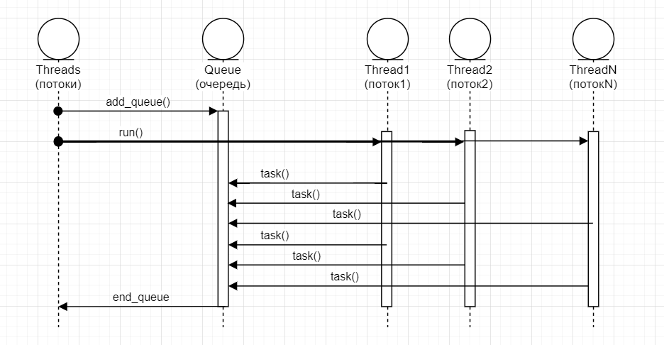

# Класс Threads. Пул потоков
Необходимость создания пула потоков возникла в связи с ускорением запросов к PostgreSQL. В процессе работы над разделом [Ускоряем запросы используя многопоточность](./PGConnection.md) мы разделили класс PGConnection_Pool (Пул соединений) на два, выделив базовый класс Treads (Потоки). Следуем основному принципу: Повторное использование кода.  
  
Создаем папку treads. Папки с подсистемами располагаем на одном уровне: те имеем главную папку Мои Проекты. В ней  находятся папки threads, pgconnection, config, _include и другие.  
  
Итак, класс Treads.  
Назначение класса Threads: создание пула потоков для параллельной (многопоточной) обработки заданий, сохраняемых в очереди заданий. Т.е. мы будем добавлять в очередь задания и вызывать метод run() для запуска многопоточного выполнения этих заданий. Задания представляют собой простые функции. Особенность в том, что эти функуии - любые, т.е. могут возвращать любое значение и получать любые параметры.  
Класс Treads должен позволять наследникам (ООП) изменять способ обработки этих заданий. Т.е. наследник может переписать функцию, передаваемую потоку.  
Метод run() должен дождаться окончания выполнения всех потоков. А поток должен забирать задания из очереди и выполнять их до тех пор пока задания в очереди не кончатся.  
Построим диаграмму, на которой представим работу класса Threads:  
  
## Определение класса Threads
Для опредения этого класса будем использовать шаблоны, поэтому разделить на файл заголовка и файл реализации мы не сможем - объявим класс и реализуем в одном файле. В папке threads создаем файл threads.hpp и добавим в него код заголовка.  
threds.hpp  
```c++
#include <mutex>
#include <thread>
#include <vector>
#include <functional>

/* --------------------------------------------------- */
/*                       HEADER                        */
/* --------------------------------------------------- */
template <typename R, typename ...Args>
class Threads {
public:
    typedef std::function<R(Args...)> Queue_Fn;    
    typedef std::function<void(Queue_Fn)> Loop_Fn;

private:
    int num_threads;
    std::mutex queue_mutex;
    std::vector<Queue_Fn> queue;

    Queue_Fn get_task(bool* queue_end);

public:
    Threads(int _num_threads);
    void add_queue(std::vector<Queue_Fn> _queue_async);
    void run(Args... args);

protected:
    virtual void wrapper_loop(int num_thread, Args... args){
        loop(nullptr, args...);
    }
    void loop(Loop_Fn _fn, Args... args);
};
```
Мы будем использовать мьютексы, потоки, векторы и функторы, поэтому добавим соответсвующие библиотеки.  
```c++
#include <mutex>
#include <thread>
#include <vector>
#include <functional>
```
### Шаблон класса Threads
Класс Threads, собственно, не является обычным классом - это шаблон. Объеявление перед классом указывает на это.  
```c++
template <typename R, typename ...Args>
```
Шаблон это прототип класса. Когда мы будем создавать объект этого класса мы будем передавать параметры R и Args. В зависимости от передаваемых параметров, компилятор будет создавать уже конкретные классы для каждого типа R и Args. Этот процесс называется инстанцирование.  
### Специальные типы
В классе Threads определим два типа:  
```c++
public:
    typedef std::function<R(Args...)> Queue_Fn;    
    typedef std::function<void(Queue_Fn)> Loop_Fn;
```
Тип ```Queue_Fn``` - это функция типа R(Args..), т.е. возвращаемый тип R, а аргументы функции Args... Например, R = std::string, а Args... = int, тогда тип функции Queue_Fn можно записать так ``` std::string(int)```. Конструкция Args... называется Parameter Pack. Эта конструкция используется, когда мы заранее не знаем сколько и какие аргументы мы будем передавать в функцию.  
Фукции Queue_Fn - это функции, которые мы будем записывать в очередь заданий.  
  
Тип ```Loop_Fn``` - это функция типа ```void(Queue_Fn)```.  
Loop_Fn - это функция, которая будет передаваться потоку. Эта функция в качестве аргумента должна принимать задание (Queue_Fn) и как-то обрабатывать его. Т.е. поток вытаскивает из очереди задание и передает его этой функции. Если эта функция пустая, то поток просто выполняет задание Queue_Fn.  
Эта функция вводится специально, чтобы наследники класса Thread смогли определять свое поведение.  
### Закрытык члены
Теперь задаем закрытые члены класса
```c++
private:
    int num_threads;
    std::mutex queue_mutex;
    std::vector<Queue_Fn> queue;

    Queue_Fn get_task(bool* queue_end);
```
Свойство ```num_threads``` - количество потоков. Это свойство содержит значение а не указатель, так как объект класса Threads будет жить неопределенно долго, то количество потоков будет хранить при себе. Конструктор будет копировать, переданное ему, количество потоков в это свойство.  
Свойство ```queue_mutex``` явдяется мьютексом и будет защищать очередь от одновременного использования потоками.  
Свойство ```queue``` - это очередь заданий, которое является вектором, содержащим ссылки на функции типа Queue_Fn.  
Метод ```get_task()``` - получает задание (Queue_Fn) из очереди, удаляет его из очереди и передает задание потоку.  
### Защищенные члены
Защищенные методы, доступны из класса наследника:
```c++
protected:
    virtual void wrapper_loop(int num_thread, Args... args){
        loop(nullptr, args...);
    }
    void loop(Loop_Fn _fn, Args... args);
```
Метод ```loop()``` - это цикл, который выполняется в потоку. Он получает задание, вызывая метод get_task(), и передает это задание функции Loop_Fn, вместе с аргументами Args...  
Этот метод нельзя переопределять наследникам. Для это создан метод ```wrapper_loop()```, который является оберткой для loop. Этот метод переопрелеяется насдедниками и в нем определяется функция обработки задания. Как видим, в базовом классе Threads функция Loop_Fn являеся пустой и поэтому loop() будет просто выполнять задание, без передачи его Loop_Fn.  
### Публичные члены
И наконец, публичные члены класса Threads, котрые мы используем в коде:
```c++
public:
    Threads(int _num_threads);
    void add_queue(std::vector<Queue_Fn> _queue_async);
    void run(Args... args);
```
Конструктор ```Threads()``` получает количество потоков и инициализирует свойства класса.  
Метод ```add_queue()``` добавляет задания в очередь.  
Метод ```run()``` создает потоки и передает каждому потоку метод wrapper_loop() со списком аргументов для задания.  
## Реализация класса Threads 
### Конструктор Threads
Конструктор пустой, только инициализирует свойства класса.
```c++
template <typename R, typename ...Args>
Threads<R, Args...>::Threads(int _num_threads = std::thread::hardware_concurrency())
    : queue()
    , num_threads(_num_threads) {};
```
Как видно, при написании реализации, перед каждым методом опять указываем ключевое слово template с описанием передаваемых шаблону типов: ```template <typename R, typename ...Args>```. А также перед методом указываем название класса с параметрами шаблона: ```Threads<R, Args...>```. Parameter pack при написании класса указывется немного по-другому: ```Args...``` вместо ```...Args```. Это называется раскрыть parameter pack.  
Итак, конструктор создает очередь ```queue```, вернее пустой вектор и копирует количество потоков в свойство ```num_threads```.

### Добавление очереди. Метод add_queue()
Метод ```add_queue()``` добавляет задания в очередь.  
```c++
template <typename R, typename ...Args>
void Threads<R, Args...>::add_queue(std::vector<Queue_Fn> _queue)
{
    queue_mutex.lock();
    queue.insert(queue.end(), _queue.begin(), _queue.end());
    queue_mutex.unlock();
}
```
Сначала блокируем мьютекс queue_mutex, чтобы защитить очередь от изменения другими потоками. Потом присоединяем вектор, переданный методу add_queue(), к очереди queue. Не забывавем разблокировать мьютекс.
Что такое "блокируем мьютекс" можно посмотреть [здесь](http://scrutator.me/post/2012/04/04/parallel-world-p1.aspx).  
  
### Запуск исполнения run()
Как уже упоминалось, метод ```run()``` создает потоки и передает каждому потоку метод wrapper_loop() со списком аргументов для задания. 
```c++
template <typename R, typename ...Args>
void Threads<R, Args...>::run(Args... args)
{
    std::vector<std::thread> threads(num_threads);
    for (int i = 0; i < num_threads; i++) {
        threads[i] = std::thread(&Threads::wrapper_loop,
            std::ref(*this), i, args...);
    }
    for (int i = 0; i < num_threads; i++) {
        threads[i].join();
    }
}
```
Собственно, метод очень простой, но, наверное, самый главный в этом классе. Обращаем внимание, что потокам передается функция (вернее метод) wrapper_loop, а не сам loop. Дело в том, что этот метод (wrapper_loop) может быть переопределен наследником и тогда в методе ```run() ``` наследника будет передаваться потоку уже переопределенный метод wrapper_loop.  
Что такое поток? Опять [сюда.](http://scrutator.me/post/2012/04/04/parallel-world-p1.aspx).  
Функция - метод??? Именно потому-что wrapper_loop - метод, мы должны передать в поток и сам объект, которому принадлежит этот метод ```std::ref(*this)```. Еще одна тонкость: если мы передадим сам объект, то поток просто скопирует его себе и тогда все потоки будут работать с разными объектами и обрабатывать разные очереди. Поэтому передаем ссылку ```std::ref``` на этот объект. Кроме того, потоку передаются аргументы функции wrapper_loop ```i, args...```.  
  
И еще одна тонкость - никогда не использовать конструкцию ```for``` при работе с массивами или векторами. Изначально конструкцию ```for``` мы написали, наверно, для примера, и чтобы обратить на это внимание. [Используем итераторы.](https://metanit.com/cpp/tutorial/7.3.php)  
Наш метод перепишем следующим образом:
```c++
template <typename R, typename ...Args>
void Threads<R, Args...>::run(Args... args)
{
    std::vector<std::thread> threads(num_threads);
    std::vector<std::thread>::iterator iter = threads.begin();
    short i = 0;
    while(iter != threads.end()){
        *iter = std::thread(&Threads::wrapper_loop,
            std::ref(*this), i++, args...);
        ++iter;
    }
    iter = threads.begin();
    while(iter != threads.end()){
        (*iter).join();
        ++iter;
    }
}
```
Когда мы ушли от конструкции for, у нас пропал i, а нам нужно передать потоку его номер. Возвращаем ```i++``` - нам нужно вернуть i до инкремента, чтобы оставить 0.  
### Цикл внутри потока loop()
Метод ```run()``` передает потоку метод ```wrapper_loop()```, который, в свою очередь, вызывает метод ```loop()```. Таким образом, loop() - это цикл внутри потока.
```c++
template <typename R, typename ...Args>
void Threads<R, Args...>::loop(Loop_Fn _fn, Args... args)
{
    Queue_Fn task;
    bool queue_end = false;
    while (!queue_end) {
        task = get_task(&queue_end);
        if (!queue_end) {                
            if(task) {
                if(_fn){
                    _fn(task);
                }
                else{
                    task(args...);
                }
            }
            else {
                std::cout << "Task not found." << std::endl;
            }
        }
    }
}
```
Снова все просто... Мы выполняем цикл пока не закончится очередь.  
Получаем задачу из очереди ```task = get_task(&queue_end);```, проверяем не пустая ли она. Затем, если ```Loop_Fn``` не пустая, то передаем ей задачу,   
иначе выполняем задачу с аргументами ```args...```.  
  
Обращаем внимание на исходный код. Здесь можно увеличить быстродействие.
```c++
    ...

    Queue_Fn task;
    bool queue_end = false;
    while (!queue_end) {
        task = get_task(&queue_end);
    
    ...
```
Заменим его следующим:
```c++
    ...

    bool queue_end = false;
    while (!queue_end) {
        Queue_Fn task = get_task(&queue_end);

    ...
```
```task``` это ссылка на функцию, поэтому выигрыша в производительности, скорее всего, не будет. Но, вырабатываем привычку. Если бы task был большим объектом, то выигрыш был бы приличным. [Вот пример.](study_cpp/return_value.md)  
### Получаем задачу из очереди get_task()
```get_task() ``` вызывается внутри потока из цикла ```loop()```. Этот метод получает задачу из очереди и передает ее функции потока ```Loop_Fn```.
```c++
template <typename R, typename ...Args>
std::function<R(Args...)> Threads<R, Args...>::get_task(bool *queue_end){
    Queue_Fn task = nullptr;
    {
        queue_mutex.lock();
        if (queue.size() != 0) {
            task = queue.front();
            queue.erase(queue.begin());
        } else {
            *queue_end = true;
        }
        queue_mutex.unlock();
    }
    return task;
}
```
Блокируем мьютекс ```queue_mutex```. Проверяем размер очереди ```queue```.   
Если размер очереди не равен нулю: получаем задачу (первое значение) и удаляем ее из очереди.  
Возвращаем задачу.  
Очередь имеет тип FIFO - первым пришел, первым ушел.  
Из нюасов: ```queue_end``` - это переменная метода ```loop()```. Эта переменная передается сюда, чтобы быть измененной, если очередь кончится.

Вот и вся реализация. Теперь пишем тесты.
## Юнит тесты
Для тестирования используем библиотеку doctest. Как ее подключить смотрите [здесь](./life_hack/add_doctest.md). Еще, в тестах будем использовать ```std::chrono_literals```, поэтому подключаем библиотеку:  
```c++
#include <chrono>
```
### Основной тест
В файле threads.hpp пишем тесты.  
threads.hpp  
```c++
/* --------------------------------------------------- */
/*                       TESTS                         */
/* --------------------------------------------------- */

TEST_SUITE("Тест класса Threads"){
    int static count = 0;
    std::mutex static count_mutex;
    void count_task() {
        count_mutex.lock();
        count += 1;
        count_mutex.unlock();
    }
    Threads<void> threads(3);
    std::vector<Threads<void>::Queue_Fn> queue (4, count_task);

    TEST_CASE("Количество вызовов задач") {
        threads.add_queue(queue);
        threads.run();
        CHECK(count == 4);
    }
}
```
Создаем счетчик, который будем увеличивать из нашего задания, помещенного в очередь.  
Так как задание будет выполнятся из потока, защищаем счетчик мьютексом (см. [здесь](http://scrutator.me/post/2012/04/04/parallel-world-p1.aspx)).  
```c++
    int static count = 0;
    std::mutex static count_mutex;
```
Далее, собственно, само задание, которое будем помещать в очередь.  
Здесь просто увеличиваем счетчик.  
```c++
    void count_task() {
        count_mutex.lock();
        count += 1;
        count_mutex.unlock();
    }
```    
Создаем объект ```Threads<void>```.  
```void``` указвает на тип возвращаемого значения задания (см. тип ```Queue_Fn```). Аргумент ```Args...``` опускаем, т.к. у функции-задания нет аргументов.  
Таким образом, тип функции - задания будет следующим ```void(void)```.  
Указываем, что задания будут ваполнять три потока.  
```c++
    Threads<void> threads(3);
```
Добавляем четыре задания в очередь.  
```c++
    std::vector<Threads<void>::Queue_Fn> queue (4, count_task);
```
  
Далее добавялем очередь.  
```c++
    threads.add_queue(queue);
```        
Выполняем.  
```c++        
    threads.run();
```    
Так как в очереди четрыре задания, то и счетчик должен увеличиться на чертыре, независимо от количества потоков.  
```c++
      CHECK(count == 4);
```          

### Еще тест и расширим класс Threads
Нам нужно проверить, что в очереди не осталось ни одного задания. Для этого в класс ```Threads``` добавим метод ```queue_size()```.  
В секцию HEADER добавим обпределение:  
```c++
    int queue_size();
```
В секцию IMPLEMENTATION добавим реализацию:  
```c++
template <typename R, typename ...Args>
unsigned int Threads<R, Args...>::queue_size()
{
    std::lock_guard<std::mutex> guard_mutex(queue_mutex);
    return queue.size();
}
``` 
Размер очереди тоже получаем безопасно: блокируем мьютекс (см. [здесь](http://scrutator.me/post/2012/04/04/parallel-world-p1.aspx)). Для этого используем ```std::lock_guard``` - класс, который в десрукторе разблокирует мьютекс. Не надо заботиться о разблокировании.

В секцию TESTS добавим проверку. Перепишем TEST_CASE:  
```c++
    ...

    TEST_CASE("Количество вызовов и размер очереди") {
        threads.add_queue(queue);
        CHECK(threads.queue_size() == 4);

        threads.run();
        CHECK(count == 4);
        CHECK(threads.queue_size() == 0);
    }
```
До выполнения заданий очередь должна сожержать 4 задания. После выполнения заданий очередь должна содержать 0 заданий.  

### Проверяем многопоточность
В предыдущем разделе мы проверили размер очереди и количество вызовов заданий.  
Теперь проверим: действительно ли, задания выполняются всеми потоками. А может быть один поток за всех отдувается?  
Проверим количество потоков и все потоки должны выполнить хотя бы одно задание.  
Проверим, действительно ли задаие принимает аргументы и возвращает их.
```c++
TEST_SUITE("Тест класса Threads"){
    ...

    TEST_CASE("Количество вызовов задач") {
        ...
    }

    int num_threads = 3; // количество потоков
    std::vector<int> static counts(num_threads, 0);
    // std::mutex static counts_mutex;

    int counts_task(int i) {
        using namespace std::chrono_literals;
        std::this_thread::sleep_for(10ms);
        // std::lock_guard<std::mutex> guard_mutex(counts_mutex);
        counts[i] += 1;
        return i;
    }
}
```
Количество потоков зададим: три.  
Счетчики количества выполненных задач для каждого потока поместим в вектор, где индекс будет номером потока.  
Счетчики мюьтексом защищать не будем, так как потоки обращаются к разным элементам вектора (не знаю насколько это правильно).  
Функция - задание теперь должна принять номер потока, увеличить номер счетчика, соответствушему потоку, и вернуть номер потока. В функции поместим ```sleep_for```, иначе задания выполняются очень быстро и один поток может успеть выполнить все.  
  
Определим наследника класса ```Threads```, который обрабатывет ```Queue_Fn``` следующего типа ```int(int)```, где заданию передается и возвращается номер процесса.
```c++
TEST_SUITE("Тест класса Threads"){
    ...

    TEST_CASE("Количество вызовов задач") {
        ...
    }

    ...

    class Test_Threads: public Threads<int, int> {
    public:
        Test_Threads(int num_threads)
            : Threads<int, int>(num_threads) {};
    protected:
        void wrapper_loop(int num_thread, int arg) override{
            Threads<int, int>::loop([num_thread](Queue_Fn task) {
                int res = task(num_thread);
                // CHECK(res == num_thread);
            }, num_thread);
        }
    };
}    
```
В определении класса указываем, что класс не будет шаблоном, а родительскому классу указываем параметры шаблона напрямую.  
```c++
class Test_Threads: public Threads<int, int>
```
Конструктор наследника просто вызывает констркуктор родителя.  
Метод ```wrapper_loop(int num_thread, int arg)``` переопределим. Здесь мы точно знаем количество аргументов, поэтому указываем один аргумент ```int arg```.  
В методе ```wrapper_loop()```  вызывем метод ```loop()```, которому передаем лямбда функцию:  
```c++
        [num_thread](Queue_Fn task) {
            int res = task(num_thread);
            CHECK(res == num_thread);
        }
```
, где в ```[num_thread]``` указываем переменную - значение номера потока. Аргументом этой функции будет задача ```task``` с типом ```Queue_Fn```, т.е. ```int(int)```.  
В лямбда функции можем проверить возвращвемое значение задания и сравнить его с номером потока. Номер потока присваивается в момент создания потока и доступен внутри потока, т.е. в методе ```wrapper_loop()```.  

Далее ...  
```c++
    const int num_tasks = 100; // количество заданий
    Test_Threads test_threads{num_threads};
    std::vector<Test_Threads::Queue_Fn> queue2(num_tasks, counts_task);
```
... мы создаем наш класс с заданным количеством потоков 3 (```num_threads```).  
Созаем очередь с количество заданий 100 (```num_tasks```).  
Теперь, собственно, тест:  
```c++
    ...

    TEST_CASE("Равномерность выполнения потоков и размер очереди") {
        test_threads.add_queue(queue2);
        CHECK(test_threads.queue_size() == num_tasks);// Проверяем размер очереди перед выполнением

        test_threads.run(num_tasks);
        for (int i = 0; i < counts.size(); ++i){
            CHECK(counts[i] > 0);// Проверяем счетчик выполненных заданий каждого потока
        }
        CHECK(test_threads.queue_size() == 0);// Проверяем размер очереди после выполнения
    }
}
```
